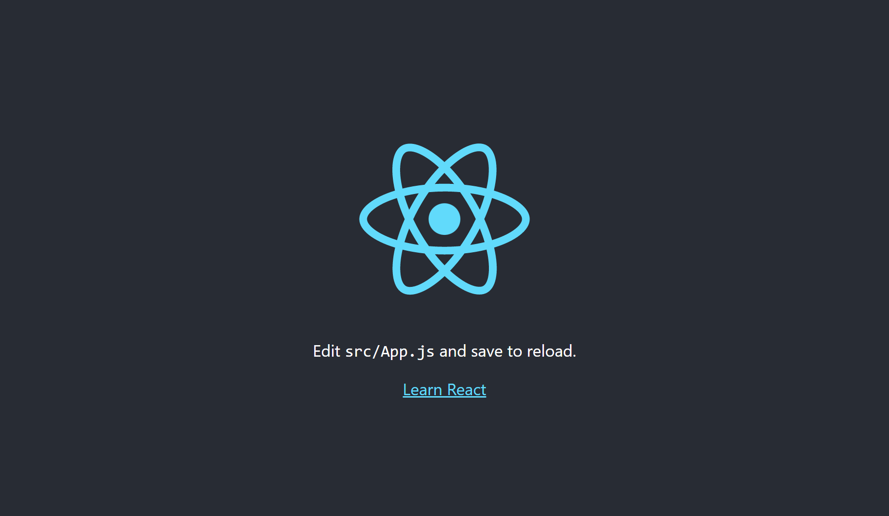

# Learn React on Docker

## Documentation
- [Docker command](DockerCommand.md)

## Composition
```text
.
|- app
|- docker-compose.yaml
`- Dockerfile
```

## Getting Started
1. Create Docker image.
    ```sh
    docker-compose build
    ```
1. Create a container and a React project.  
    --rm: Automatically remove the container when it exits.
    ```sh
    docker-compose run --rm app sh -c "npm install -g create-react-app && npx create-react-app ."
    ```
1. Run container.
    ```sh
    docker-compose up -d
    ```
1. Access "http://localhost:3001" from your browser; you should see the React screen.
    

## Enable hot reloading.
1. Create an .env file and set the polling mode to true.
    ```sh
    echo "CHOKIDAR_USEPOLLING=true" > app/.env
    ```
1. Add polling mode to the environment variable in docker-compose.yml as well.
    ```yml
    environment:
      - CHOKIDAR_USEPOLLING=true
    ```
1. Restart the application.
    docker exec -it react-learn sh -c "npm run restart"

## Docker command
Rebuild.
```sh
docker-compose up -d --build
```

Service Log.
```sh
docker compose logs -f
```

Connect to container.
```sh
docker exec -it react-learn sh
```

Delete build cache.
```sh
docker builder prune
```