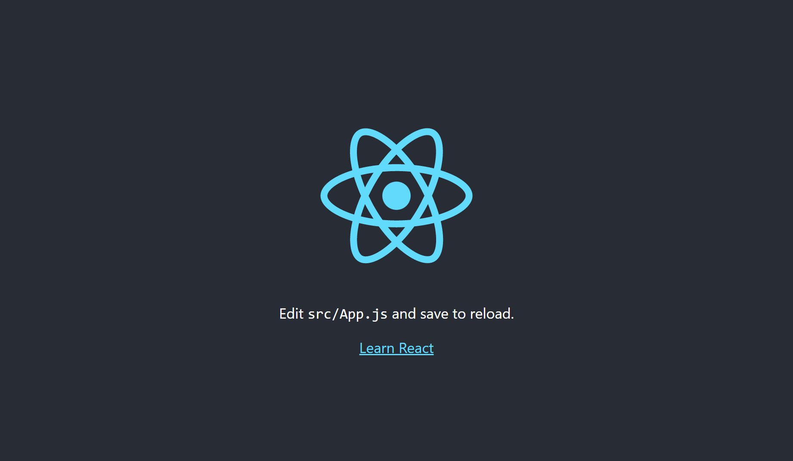

# React on Docker
Run React apps in Docker.

## Composition
```text
.
|- app
|- docker-compose.yaml
`- Dockerfile
```

## Getting Started
1. Create Docker image.
    ```sh
    docker-compose build
    ```
1. Create a container and a React project.  
    --rm: Automatically remove the container when it exits.
    ```sh
    docker-compose run --rm app sh -c "npm install -g create-react-app && npx create-react-app ."
    ```
1. Run container.
    ```sh
    docker-compose up -d
    ```
1. Access "http://localhost:3001" from your browser; you should see the React screen.
    

## Docker command
Container logs.
```sh
docker compose logs -f
```

Connect to container.
```sh
docker exec -it react-learn sh
```

Rebuild.
```sh
docker-compose up -d --build
```

Delete build cache.
```sh
docker builder prune
```

Restart the application.
```sh
docker exec -it react-learn sh -c "npm run restart"
```
